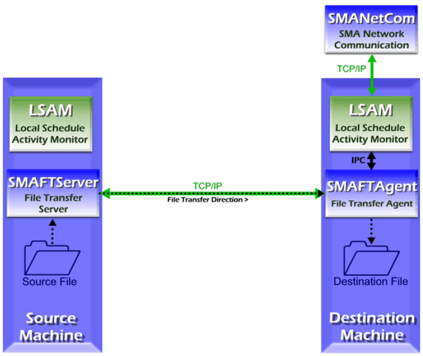

# File Transfer

## Introduction

The SMA File Transfer (SMAFT) system reliably transfers files across multiple platforms via an OpCon job. The SMA/FTAGENT, SMA/FTSERVER, and SMA/FTHANDLER components are installed with the MCP LSAM. The source and destination machines must have these components for a file transfer.
 
After receiving instructions from the resident LSAM, the SMAFT component determines the best method for transporting the file with the corresponding SMAFT component on the participating machine. After negotiating the file transfer settings, the file is transferred. Configuration in the Enterprise Manager and on the LSAM machine (refer to [MCP LSAM Configuration](../../configuration/mcp-lsam-configuration)) in addition to the File Transfer Job's details (refer to [File Transfer Job Details](https://help.smatechnologies.com/opcon/core/job-types/file-transfer) in the Concepts online help) dictate a transfer's behavior. Also, refer to Print File Conversion later in this topic for a utility that can be used to prepare the contents of an MCP print file for transfer to a Windows/UNIX/ASCII-based machine.
 
The MCP SMA/FTSERVER permits the user to configure up to nine concurrent transfers.

:::info Note

If encryption and/or compression are "Preferred", the transfer takes place but the job appears as Failed with a status description of P-DS.

:::

:::info Note

When using an MCP file for the Source File or Destination File on the Job Details, the full file title must be entered, including the usercode and family.

:::

## File Transfer Requirements

Additional disk space is required to run SMA File Transfer:

1. SMAFTAGENT requirements:

    a. Prior to initiating the MCP SMAFT Agent, the MCP LSAM creates a temporary file called \*TEMP/SMAFTPARMS/```<SAM job id>```. This file is later removed by the SMAFT Agent if debugging is not active.
    
    b. Upon receiving the source file parameters and data, the SMA/FTAGENT creates a temporary file to contain the incoming data stream. The temporary file, named TEMP/SMAFT/```<10-digit SAM job id>``` is located on the primary family associated with the usercode used to initiate the LSAM. Immediately prior to the SMA/FTAGENT going to end of job, this temporary file is removed (unless debugging has been set). The size of the temporary file varies depending on the two platforms involved in the transfer, the type of transfer, and the amount of data being transferred. Allow approximately 20% more than the size of the source file as a general rule. In most cases, this figure will be more than sufficient to accomplish the transfer.
    
    c. If the user has requested that the destination file be backed up (Backup, Overwrite or Backup, Append), a copy of the existing destination file will be made. This backup file is named by appending the backup node specified in the MCP LSAM configuration file to the name of the existing destination file. In effect, there must be sufficient disk space to duplicate the existing destination file as it exists before the start of the transfer request.
    
    d. Some additional disk space is used to present the destination file in a format consistent with files on the destination platform. For text files, the MCP destination file will generally consume more bytes than the source file, particularly if the source machine stores data files as stream files rather than fixed-length record files. For binary transfers, the size of the destination file can be expected to more closely approximate the size of the source file, in bytes.

2. SMAFTSERVER requirements:
    
    a. At this time, the SMAFTSERVER does not require additional disk space for use in transferring the source file.

### SMA File Transfer Architecture



## Configuration

Before attempting a transfer, configure the machines in the Enterprise Manager and in the source and destination machines' LSAMs.
 
In the source and destination machines' LSAM configuration files, define the parameters for file transfers. For many LSAMs, these settings are commingled with the LSAM's Job Output Retrieval System (JORS) parameters. However, for the MCP LSAM, JORS and the 
FTSERVER are separate processes and are configured individually.

* For MCP LSAM file transfer parameters, refer to [SMA File Transfer (SMAFT)](../../operations-and-components/sma-manager/optional-modules#sma-file-transfer-smaft) in the Optional Modules (OPT) topic.

* For Microsoft LSAM file transfer parameters, refer to the [JORS Settings](https://help.smatechnologies.com/opcon/agents/windows/administration/configuration#jors-settings) and [SMAFT Settings](https://help.smatechnologies.com/opcon/agents/windows/administration/configuration#smaft-settings) in the Microsoft LSAM online help.

* For UNIX LSAM file transfer parameters, refer to the [JORS](https://help.smatechnologies.com/opcon/agents/unix/configuration/parameters/jors-and-smaft-parameters) and [SMAFT Parameters Settings](https://help.smatechnologies.com/opcon/agents/unix/configuration/parameters/jors-and-smaft-parameters) in the UNIX LSAM online help.

In the Enterprise Manager, adjust the Advanced Machine Settings for the destination machine to correspond with the source machine's LSAM file transfer settings (or vice versa). Under the category File Transfer Settings, define the "File Transfer" type and the "File Transfer Port Number". For information on these settings, refer to [File Transfer Jobs](https://help.smatechnologies.com/opcon/core/job-types/file-transfer) in the Concepts online help. Once configuration is complete (and verified), a File Transfer Job can be defined. For more information, refer to [File Transfer Job Details](https://help.smatechnologies.com/opcon/core/job-types/file-transfer) in the Concepts online help.
 
Within MCP SMA File Transfer, the record length applied to the destination file using predefined SMA File Transfer protocol is sometimes unacceptable for downstream user programs.

* If a file with the same name as the destination file exists, the record length of the existing file is used. This is true whether the existing file is to be overwritten or appended to.

* If there is no existing file with a name identical to the destination file, the record length will be determined in accordance with general SMA File Transfer specifications.

### Specify the Destination File Record Length

Occasionally, there is a need to provide the capability to specify the record length on the destination file in order to accommodate downstream processing of the destination file. To utilize this approach, you must modify the Destination File on the Job Details to include both the full title of the destination file title and the desired value for the file attribute MAXRECSIZE. This is supported by placing a constant of ,REC= (comma, followed by the string REC=), followed by the desired record length in bytes immediately following the destination file title in the SMA File Transfer Job Details Destination File Name.

### Specify the Destination File Blocking Factor

You may also specify the blocking factor for the MCP destination file. The blocking factor is defined as the number of records per block, and is specified by placing a constant of ,BLK=, followed by the desired blocking factor immediately following the destination file title and record length.
 
For example, if the destination file title were "(USER)DATA/FILE ON PRODPK", the desired record length is 300, and the desired blocking factor is 60 records per block, the Destination File entry would be:
 
* ```(USER)DATA/FILE ON PRODPK,REC=300,BLK=60```

### Specify the ACCESSCODE Associated with the Destination File

Some sites require an ACCESSCODE in addition to a USERCODE. To specify the ACCESSCODE, append a comma (,) followed by ACC= then the desired ACCESSCODE immediately following the file title of the destination file (i.e., is 300 and the desired blocking factor is 60 records per block). The Destination File entry would be:
 
* ```(USER)DATA/FILE ON PRODPK,REC=300,BLK=60,ACC=MYACCESSCODE```

### Logging

For the MCP LSAM, the SMAFTAGENT logs general information messages to the PRT_FTAGENT print file when SW2 is set for the LSAM. The SMAFT Server logs general information messages to the SMAFT_DEBUG_PRT print file when SW1, SW2, SW3, SW4, and SW6 are set for the LSAM. Refer to [Debug Information](../../debugging).

