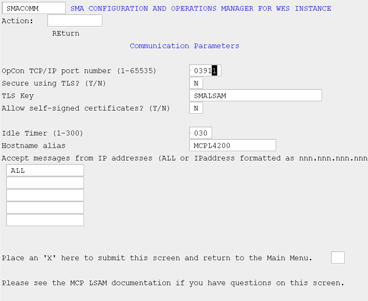

# Communication Parameters (COMM)

The Communication Parameters screen allows the user to configure the information needed to communicate scheduling messages between the LSAM and the OpCon Server.

###### SMA Configuration and Operations Manager: SMACOMM

###### MCP LSAM Configuration Settings: Communication Parameters

| Field | Description |
| ----- | ----------- |
| OpCon TCP/IP port number | This field defines the port number that should be used to communicate with SMANetCom. It must match the port number defined for this machine in the database. |
| Secure using TLS? | This field defines whether to use TLS for secure communication. If you want to use TLS to secure communications, enter a Y in this field, install a certificate using Security Center, and enter the key in the "TLS Key" field. | 
| TLS Key | This field is the key associated with the certificate used to secure scheduling communications with TLS. The certificate is stored using the Unisys Security Center. |
| Allow self-signed certificates? | This field defines whether to allow self-signed certificates. If the TLS certificate is self-signed, enter a Y in this field. |
| Idle Timer | This field is a timer that instructs the LSAM on how often to inquire for messages between LSAM components and how often to see if there are messages to send to SMANetCom. The value is in seconds. A low value means faster throughput during idle periods but increases processor usage. A high value uses less resources but can result in slower throughput during idle periods. Job start requests are not affected by this timer; however, job status updates can be affected when there is little activity initiated by SMANetCom. |
| Hostname alias | This field defines the value that corresponds to the machine name defined via the Enterprise Manager. If left blank, the system hostname will be used. When providing a value for this field, do not include an ending period (.); however, when defining the machine name in the Enterprise Manager, the trailing period (.) must be used in the Machine definition. | 
| Accept messages from IP addresses | These five fields allow one to specify from which IP addresses the LSAM will accept a request to connect. A maximum of five unique IP addresses may be entered. Alternatively, you may enter the value of "ALL" for the first IP address to instruct the LSAM to accept a connection request from any IP address. | 
| Place an 'X' here to submit this screen and return to the Main Menu | In order to save any changes you have made to this screen, you must place an 'X' in this field. If you do not want to save changes or you accessed this screen simply to inquire as to the current values, leave this field blank and transmit the screen to be returned to the main menu. |