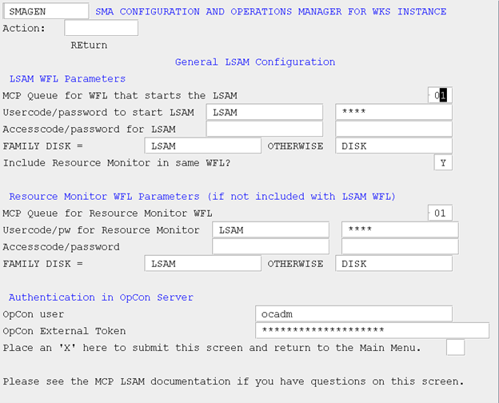

# General LSAM Configuration (GEN)

## What is it?

This page documents every field on the SMAGEN screen within SMA/MANAGER, which controls how the MCP Agent initiation WFL is constructed, which MCP usercode and family the agent runs under, whether the Resource Monitor is included in the same WFL, and the OpCon credentials used for external events.

- Use this page when setting up the MCP Agent for the first time to supply the correct queue, usercode, password, and family values that the INITLSAM option will use to build the startup WFL.
- Use this page to configure separate Resource Monitor WFL parameters when the Resource Monitor must be able to remain running independently while the MCP Agent is stopped.

The General LSAM Configuration (GEN) screen allows you to configure the information needed to create a WFL that will start the MCP Agent and optionally also the Resource Monitor. This WFL is not stored on the system but is created using the configuration fields when you select the INITLSAM and/or INITRM screens. This screen also configures the userid and external token for external events.

**SMA Configuration and Operations Manager: SMAGEN**

**MCP General LSAM Configuration**

The following table describes each field on the SMAGEN screen.

| Field | Description |
| ----- | ----------- |
| LSAM WFL Parameters | MCP Queue for WFL that starts the MCP Agent. This field defines the MCP QUEUE that should be used to start the MCP Agent (and Resource Monitor if it is to be initiated along with the agent). |
| Usercode to start the LSAM | This field defines the MCP usercode under which the MCP Agent should be started. This should be the same usercode that was used to install/upgrade the agent. |
| Password for Usercode to start the LSAM | This field defines the password associated with the MCP usercode under which the MCP Agent should be started. |
| Accesscode to start the LSAM | This field defines the ACCESSCODE under which the MCP Agent should be started. |
| Password for the Accesscode used to start the LSAM | This field defines the password associated with the ACCESSCODE under which the MCP Agent should be started. | 
| FAMILY DISK = | This field defines the primary family to be used by the MCP Agent. It should be the same as the primary family associated with the USERCODE above. |
| OTHERWISE	| This field defines the secondary family to be used by the MCP Agent. If there is no secondary family, leave this field blank. |
| Include Resource Monitor in same WFL?	| This flag specifies that a single WFL should be used to initiate both the MCP Agent and the SMA/RESOURCE/MONITOR. When combined, a single option (INITLSAM) starts both the agent and the Resource Monitor. However, if you want to keep the Resource Monitor separate from the MCP Agent so that you can stop the agent while allowing the Resource Monitor to continue to monitor the system entities, enter an "N" in this field and proceed to define values for the Resource Monitor WFL Parameters. | 
| Resource Monitor WFL Parameters (if not included with LSAM WFL) | |
| MCP Queue for Resource Monitor WFL | This field defines the MCP QUEUE that should be used to start the MCP Resource Monitor if it is not to be initiated along with the MCP Agent. |
| Usercode to start the Resource Monitor | This field defines the MCP usercode under which the MCP Resource Monitor should be started. This should be the same usercode that was used to install/upgrade the agent. |
| Password for Usercode to start the Resource Monitor | This field defines the password associated with the MCP usercode under which the Resource Monitor should be started. | 
| Accesscode to start the Resource Monitor | This field defines the ACCESSCODE under which the Resource Monitor should be started. |
| Password for the Accesscode used to start the Resource Monitor | This field defines the password associated with the ACCESSCODE under which the Resource Monitor should be started. |
| FAMILY DISK =	| This field defines the primary family to be used by the MCP Resource Monitor. It should be the same as the primary family associated with the USERCODE above. |
| OTHERWISE	| This field defines the secondary family to be used by the MCP Resource Monitor. If there is no secondary family, leave this field blank. |
| Authentication in OpCon Server | |
| OpCon user | This field defines the OpCon userid to be used with external events. It must also be defined within the OpCon database. |
| OpCon External Token | This field defines the external token associated with the OpCon User. |
Place an 'X' here to submit this screen and return to the Main Menu	| In order to save any changes you have made to this screen, you must place an 'X' in this field. If you do not want to save changes, or you had accessed this screen simply to inquire as to the current values, leave this field blank and transmit the screen to be returned to the main menu. | 

:::info Note

All password fields on the SMAGEN screen are masked. Passwords entered on this screen are stored in an encoded format — they are not stored in plaintext.

:::
