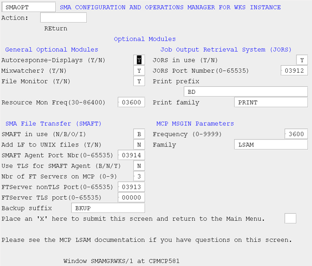

# Optional Modules (OPT)

The Optional Modules screen allows the user to configure the following:

* Enable/disable general features such as Automated Response, Job Adoption, File Monitor, and Resource Monitor
* Define values for variables that enable Job Output Retrieval (JORS)
* Define values for variables that affect SMA File Transfer
* Define MSGIN variables

###### SMA Configuration and Operations Manager: SMAOPT

## MCP LSAM Configuration Settings: Optional Modules

## General Optional Modules

### Autoresponse-Displays

This field indicates whether the Auto-Response feature is active.

### Mixwatcher?

This field determines whether or not the LSAM tracks external jobs.

* If Y, the LSAM tracks external jobs.

Note: Once detected, tracked jobs are displayed in the Enterprise Manager.

* If N, the LSAM does not track external jobs.

### File Monitor

This field indicates whether File Monitor should be started by the Resource Monitor.

### Resource Mon Freq

This field sets the approximate number of seconds the Resource Monitor should wait between performance metrics samples:

* 3600 = one hour

* 86400 = 24 hours

## Job Output Retrieval System (JORS)	 

### JORS in use

This field determines whether or not the LSAM will initiate the *SMA/JORS/xxx program.

### JORS Port Number

This field specifies the port number used for communicating job output information with the Enterprise Manager.

The JORS port number must also be configured on the Administration > Machines > Advanced Settings > Communication Settings > JORS Port Number in the Enterprise Manager.

###Print Prefix	

This field defines the initial node(s) of the print file names.

The LSAM uses this value and the mix number (and, optionally, the usercode of the job) to locate the print files by preceding the job's mix number with this prefix (e.g., *BD/00jjjjj).

Although multiple nodes may be used to define the print file prefix, multiple print file prefixes are not supported.

### Print Family	

This field specifies the diskpack on which print files are located.

## SMA File Transfer (SMAFT)	 

### SMAFT in use	

This field indicates the permitted directions for SMA File Transfer.

* If N, file transfer is not in use (default).
* If B, bi-directional transfer is okay.
* If O, only outgoing transfers are permitted.
* If I, only incoming transfers are permitted.

### Add LF to Unix Files	

This field determines how the file contents are stored and displayed on the UNIX system.

* If Y, the SMA File Transfer process will append a line feed (carriage control) to the end of each MCP record prior to sending the record to a UNIX platform.

The result on the UNIX platform is a text file that contains the UNIX newline character, which causes the MCP data to appear as records rather than a continuous stream of text.

:::info Note

This option only applies to SMA File Transfers using the ASCII, EBCDIC, or Default Text options - it does not apply to Binary transfers.

:::

### SMA Agent Port Number	

This field defines the port number for the agent.

### Use TLS for SMAFT Agent	

Use this field to specify whether TLS is available to be used to secure communications between the MCP FTAgent and corresponding FTServer.

* If B, the MCP FTAgent will support both TLS and non-TLS secured communications.
* If N, the MCP FTAgent will support only non-secured connections.
* If T, the MCP FTAgent will support only communications secured by TLS.

### Nbr of FTServers on MCP	

This field specifies the maximum permitted number of concurrent outgoing file transfers.

If the File Transfer variable is set to a value other than "N," the Nbr of FTServers field must be at least 1.

### FTServer nonTLS Port	

This field specifies the port number used by *SMA/FTSERVER to communicate with the File Transfer agent when not using TLS.

The FTServer port number must also be configured on the Administration > Machines > Advanced Settings > File Transfer Settings > File Transfer Port Number in the Enterprise Manager.

### FTServer TLS Port	

This field specifies the port number used by *SMA/FTSERVER to communicate with the File Transfer agent when using TLS.

The FTServer port number must also be configured on the Administration > Machines > Advanced Settings > File Transfer Settings > File Transfer Port Number in the Enterprise Manager.

### Backup Suffix	

This field specifies the suffix that should be appended to the name of the existing file prior to initiating a file transfer if backup is requested prior to the transfer.

## MCP MSGIN Parameters	 

### Frequency

This field sets the number of seconds between MSGIN file checks.

* Setting the MSGIN/ file check frequency to a low value increases overhead, but increases the frequency of file checking.
* Setting the MSGIN/ file check frequency to a high value minimizes overhead, but decreases the frequency of file checking.

### Family	

This field specifies the family on which MSGIN/= files resides. If multiple LSAMs are in use, configure each LSAM to look for MSGIN/= files on unique families.

