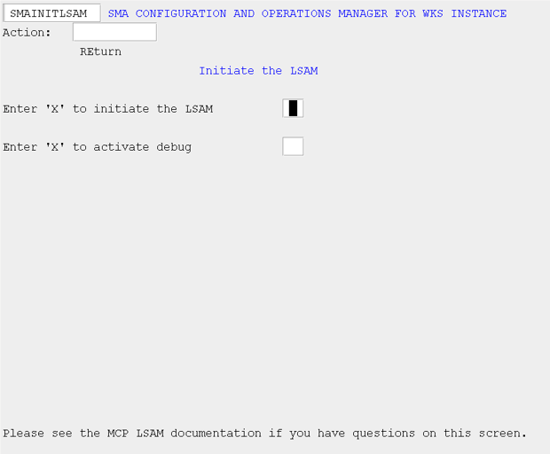
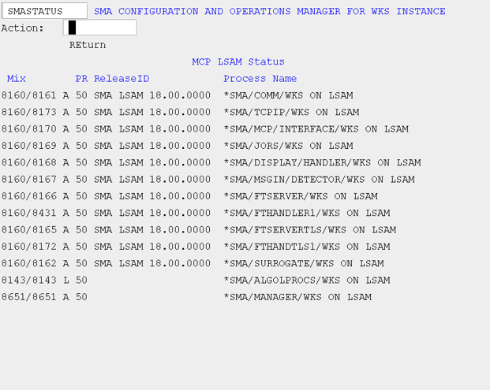
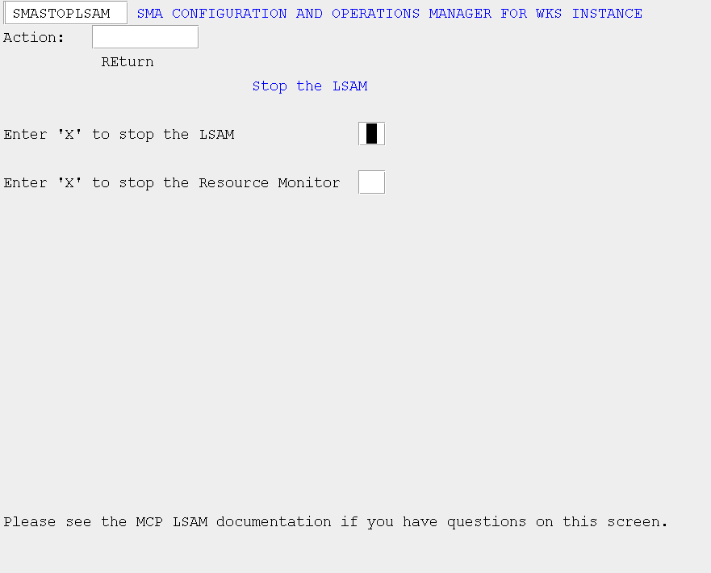

---
title: MCP LSAM Operation
description: "Start, monitor, and stop the MCP LSAM and its optional processes using the SMA/MANAGER INITLSAM, STATUS, and STOPLSAM screens."
tags:
  - Procedural
  - Operations Staff
  - Agents
  - System Configuration
---

# MCP LSAM Operation

## What is it?

This page covers the day-to-day operational procedures for managing the MCP Agent through the SMA/MANAGER interface, including how to initiate the agent (with or without debug mode), check the status of all active agent processes, and stop the agent and Resource Monitor cleanly. It identifies the three primary processes that must be active when the agent is running and lists the optional processes associated with specific features.

- Use this page when starting the agent for the first time after installation or configuration changes to confirm all required processes appear in the active mix.
- Use this page to troubleshoot suspected agent issues by reviewing the STATUS screen and locating the print files associated with each agent process.

## Start the Agent

Start the agent to begin processing OpCon jobs.

To view the previous procedure, refer to [Start the LSAM](../reference-information/legacy#start-the-mcp-agent) in the Legacy Information topic.

### Initiate the Agent (INITLSAM)

Use this screen to start the agent, and optionally the Resource Monitor if you have configured the agent to include the Resource Monitor within the agent WFL. You may also initiate the agent with debug enabled if you are attempting to capture debug information for SMA Technologies Support regarding an issue.

*SMA Configuration and Operations Manager for WKS Instance: SMAINITLSAM*



## Check Agent Status

### Status (STATUS)

The STATUS screen shows the current status of all agent modules relative to this instance. There are five columns of information:

* Mix: Defines the job and task mix number of the process.
* Process type/status: Defines the process status. The possible values for this field are A(ctive), L(ibrary), S(cheduled), and W(aiting).
* PR (Priority): Defines the priority.
* ReleaseID: Defines the release ID.
* Process Name: Defines the process name.

*SMA Configuration and Operations Manager for WKS Instance: SMASTATUS*



### Primary Process

Three primary processes should be in the active mix when the agent is running:

* *SMA/COMM/xxx
* *SMA/MCP/INTERFACE/xxx
* *SMA/TCPIP/xxx

If all three of the processes are active, but a problem is still suspected, view the print files for each process. The print file for each process can be found under *BD/```<Mix # of LSAM's Parent Process>```, unless the site has assigned a unique BDNAME to the agent's print files.

### Optional Processes

There are other optional processes that should be in the active mix when a particular feature is functioning:

* *SMA/FILE/MONITOR/xxx for File Monitor
* *SMA/RESOURCE/MONITOR/xxx for Resource Monitor
* *SMA/SURROGATE/xxx for monitoring adopted/tracked jobs
* *SMA/JORS/xxx for the Job Output Retrieval System
* *SMA/MSGIN/DETECTOR/xxx for MSGIN
* *SMA/DISPLAY/HANDLER/xxx for Auto Response

## Stop the Agent

### Stop the Agent (STOPLSAM)

Use this screen to stop the agent, and optionally the Resource Monitor as well. You may also stop the Resource Monitor using the STOPRM main menu option.

*SMA Configuration and Operations Manager for WKS Instance: SMASTOPLSAM*



To view the previous procedure, refer to [Stop the LSAM](../reference-information/legacy#stop-the-mcp-agent) in the Legacy Information topic.
