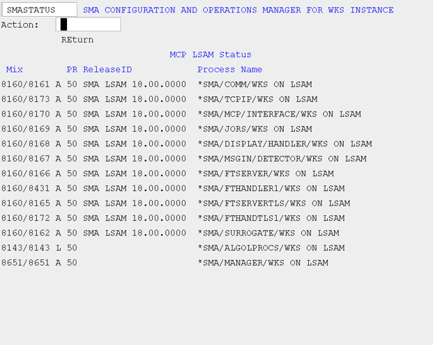

# MCP LSAM Operation

## Start the LSAM

Start the LSAM to begin processing OpCon jobs.

To view the previous procedure, refer to [Start the LSAM](../reference-information/legacy#start-the-lsam) in the Legacy Information topic.

### Initiate the LSAM (INITLSAM)

Use this screen to start the LSAM, and optionally the Resource Monitor if you have configured the LSAM to include the Resource Monitor within the LSAM WFL. You may also initiate the LSAM with debug enabled if you are attempting to capture debug information for SMA Technologies Support regarding an issue.

###### SMA Configuration and Operations Manager for WKS Instance: SMAINITLSAM


## Check LSAM Status

### Status (STATUS)

The STATUS screen shows the current status of all LSAM modules relative to this instance. There are five columns of information:

* Mix: Defines the job and task mix number of the process.
* Process type/status: Defines the process status. The possible values for this field are A(ctive), L(ibrary), S(cheduled), and W(aiting).
* PR (Priority): Defines the priority.
* ReleaseID: Defines the release ID.
* Process Name: Defines the process name.

###### SMA Configuration and Operations Manager for WKS Instance: SMASTATUS



### Primary Process

Three primary processes should be in the active mix when the LSAM is running:

* *SMA/COMM/xxx
* *SMA/MCP/INTERFACE/xxx
* *SMA/TCPIP/xxx

If all three of the processes are active, but a problem is still suspected, view the print files for each process. The print file for each process can be found under *BD/```<Mix # of LSAM's Parent Process>```, unless the site has assigned a unique BDNAME to the LSAM's print files.

### Optional Processes

There are other optional processes that should be in the active mix when a particular feature is functioning:

* *SMA/FILE/MONITOR/xxx for File Monitor
* *SMA/RESOURCE/MONITOR/xxx for Resource Monitor
* *SMA/SURROGATE/xxx for monitoring adopted/tracked jobs
* *SMA/JORS/xxx for the Job Output Retrieval System
* *SMA/MSGIN/DETECTOR/xxx for MSGIN
* *SMA/DISPLAY/HANDLER/xxx for Auto Response

## Stop the LSAM

### Stop the LSAM (STOPLSAM)

Use this screen to stop the LSAM, and optionally the Resource Monitor as well. You may also stop the Resource Monitor using the STOPRM main menu option.

###### SMA Configuration and Operations Manager for WKS Instance: SMASTOPLSAM


To view the previous procedure, refer to [Stop the LSAM](../reference-information/legacy#stop-the-lsam) in the Legacy Information topic.