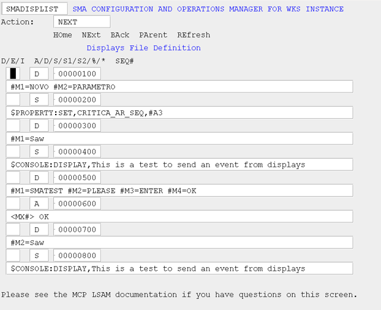
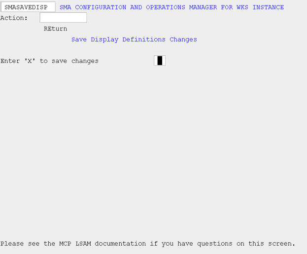

# Displays Definition File Maintenance (DISPLIST)

Use this screen to modify records within the displays definition file.

###### SMA Configuration and Operations Manager: SMADISPLIST

There are various navigation paths you can take from this screen, depending on the value in the Action field:

* HOme: This will take you directly to the Manager Main Menu without processing any of the changes you may have entered.
* NExt: This will process the changes you have made on this page and then display the next eight records in the definitions file.
* BAck: This will process the changes you have made on this page and then display the previous eight records in the definitions file.
* PArent: This will take you directly to the SAVEDISP screen where you will be given the opportunity to permanently save the changes you may have entered.
* REfresh: This will redisplay the original values from the previous presentation of this screen without processing any of the changes you may have entered. This Action is useful if you want to discard all changes you have made on this screen and want to start over.

Errors will be displayed in the status field at the bottom of the screen. If there are no errors, the changes will be temporarily saved.

## MCP LSAM Configuration Settings: Displays Definition File Maintenance (DISPLIST)

### D/E/I

This field is the action you want to perform on a given record.

* If D, delete the record at this sequence number in the file.
* If E, edit the record at this sequence number in the file.
* If I, insert a record at this sequence number in the file. You must also enter a sequence number that falls between the previous record and the next record in the file.

### A/D/S/S1/S2/%/*

This field is the record type.

* If A, the record type is an action that is to take place on the MCP platform
* If D, the record type is the definition of the tokens within the message that should be used to identify the target message
* If S, the record type is the external event that is to be sent to the OpCon server for processing. All external events must begin with a dollar sign ($).
* S1 and S2 are used when the external event is longer than 70 characters.
    * Use S1 for the first part of the event (include the $ sign).
    * Use S2 for the latter part of the event (no $).
    * Possible external OpCon events are documented in [External Events](https://help.smatechnologies.com/opcon/core/events/defining#external-events) in the OpCon Events online help.
* % and * are used to denote that this is a comment. This is useful when you want to temporarily disable a definition or action, but do not want to permanently delete it from the file, or when you want to add an explanation.

### SEQ \#

This field is the sequence number associated with this record in the definitions file. To modify or delete an existing record, leave the sequence number field as is. To insert a new record in the definitions file, enter an 8-digit sequence number that falls between the previous record and the next record. If you are on the last page and want to add records to the end of the file, simply enter sequence numbers that are successively greater than the last existing record’s sequence number.

The long field below the action, type, and sequence line is used to define the message for which to monitor or the action to take or to add a comment. Refer to the detailed description in the [Automated Response Data File](../../additional-features/lsam-features/automated-response#automated-response-data-file) topic for more information about each record type and how to construct the data in this field.

## Save Display Definition Changes (SAVEDISP)

Use this screen to permanently save the displays definitions changes. The definitions file will be re-sequenced as part of the save.

###### SMA Configuration and Operations Manager: SMASAVEDISP

