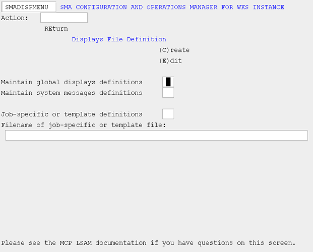

# Displays Definition File Maintenance Main Menu (DISPMENU)

Use this screen to select the displays definitions file you want to modify.

###### SMA Configuration and Operations Manager: SMADISPMENU

The global displays file is used by the LSAM to capture and analyze messages displayed by all processes/jobs initiated via OpCon. The system message file is used by the Resource Monitor to capture and analyze messages that are displayed by processes that have not been initiated via OpCon.

The job-specific (or template) file is used in a similar fashion as the global displays file, but is applied to only those OpCon jobs for which the OpCon Job Details indicates this definitions file should be used. You must supply the filename of the job-specific (or template) file. For job-specific definitions files, use the filename of the WFL source file to which the definitions file pertains, but do not include the family. All definitions files must reside on the same family as the LSAM.

Use "C" or "E" to indicate whether you want to Create or Edit the definitions file.

