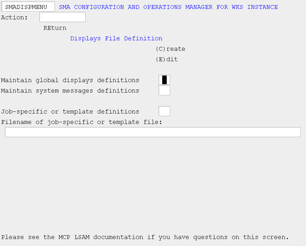

# Displays Definition File Maintenance Main Menu (DISPMENU)

## What is it?

The Displays Definition Maintenance Main Menu lets you choose between the global displays file, the system message file, and a job-specific or template file, then indicate whether to create or edit that file. The global file covers all OpCon-initiated jobs, while job-specific files apply only to jobs whose OpCon Job Details reference them.

- Use the global displays file to monitor messages from all jobs initiated by OpCon across the MCP system.
- Use a job-specific template file to apply tailored display monitoring to a single WFL source file without affecting other jobs.

Use this screen to select the displays definitions file you want to modify.

*SMA Configuration and Operations Manager: SMADISPMENU*

The global displays file is used by the agent to capture and analyze messages displayed by all processes and jobs initiated via OpCon. The system message file is used by the Resource Monitor to capture and analyze messages displayed by processes that have not been initiated via OpCon.

The job-specific (or template) file is used in a similar fashion as the global displays file, but is applied to only those OpCon jobs for which the OpCon Job Details indicates this definitions file should be used. You must supply the filename of the job-specific (or template) file. For job-specific definitions files, use the filename of the WFL source file to which the definitions file pertains, but do not include the family. All definitions files must reside on the same family as the agent.

Use "C" or "E" to indicate whether you want to Create or Edit the definitions file.

