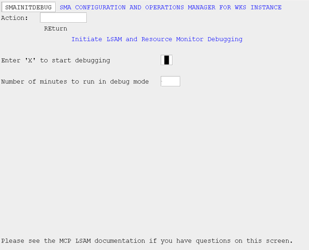
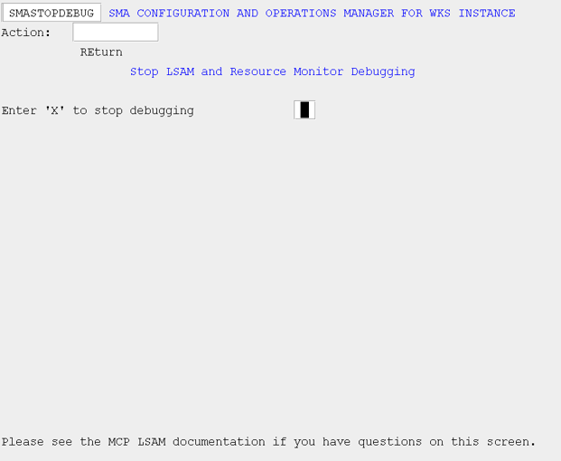

# SAM Debugging

## What is it?

The INITDEBUG and STOPDEBUG screens control debug mode for the MCP Agent, allowing you to capture diagnostic output for a specified number of minutes or until you manually stop it. Debug mode is intended for use when working with SMA Technologies Support to investigate a specific issue.

- Enable debugging with a time limit so it stops automatically without requiring a return to the STOPDEBUG screen.
- Stop an active debug session manually before the timer expires when sufficient diagnostic data has been captured.

## Initiate Agent Debugging (INITDEBUG)

Use this screen to initiate debugging for the agent. You can also specify the number of minutes for which debugging should be active. If the "Number of minutes to run in debug mode" field is left blank, debugging will continue until stopped using the STOPDEBUG menu option.

*SMA Configuration and Operations Manager: SMAINITDEBUG*

## Stop Agent Debugging (STOPDEBUG)

Use this screen to stop agent debugging if you did not specify the number of minutes for which debugging should be active, or if you want to stop debugging before the timer expires.

*SMA Configuration and Operations Manager: SMASTOPDEBUG*

