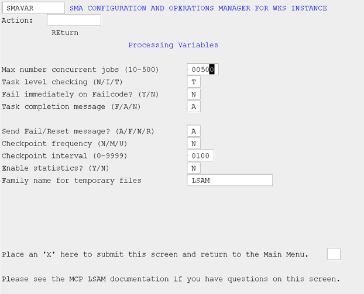

# Processing Variables (VAR)

## What is it?

The Processing Variables screen controls how the MCP Agent monitors concurrent jobs, determines job success or failure, reports task completion, creates recovery checkpoints, and stores temporary files. Most settings are dynamic and reload without restarting the Agent; the maximum concurrent jobs value requires a full stop, file removal, and restart.

- Set task-level failure checking and fail-code behavior to align job status reporting with your site's WFL error-handling standards.
- Define checkpoint frequency and interval to enable automatic recovery and restart of in-flight jobs after an unexpected Agent stoppage.

The Processing Variables screen allows the user to configure the following:

* Variables that affect the number of permissible concurrent jobs to be monitored
* Variables which alter the default determination of success or failure of a job
* The level of granularity as it pertains to job status reporting
* Whether and how frequently checkpoints are taken
* Specify an alternate family to be used for temporary files created by the agent

*SMA Configuration and Operations Manager: SMAVAR*

## MCP Agent Configuration Settings: Processing Variables

### Max number concurrent jobs

This field is a numeric value representing the maximum number of jobs initiated by OpCon that should be monitored at any given time. Tracked Jobs are not included in this number, but the same limit applies. A change to this field requires that the agent be stopped and restarted to implement the new value. This is the only field for which this is the case; all other configuration file changes are dynamic and reload when you select this action from the Main Menu.

### Task level checking

This field is used to cause a WFL job to be failed if any of its subordinate tasks fail. It is provided for those sites that have not coded WFL's to handle task failure.

:::info Note
 
Regardless of this setting, a task is always tested for a FailCode/Reset match.

:::

* If N, do not use.
* If I, a job will be marked failed immediately upon the failure of a subordinate task.
* If T, a job will be marked failed upon the failure of any subordinate task only when the job ends (EOJ). A Fail Reset match resets the JOB TO BE FAILED flag to "N".

### Fail immediately on FailCode?

This field is used in conjunction with the MCP Job Details field, Fail Code.

* If N, the job will be reported as Failed when the job completes. A Fail Reset match resets the JOB TO BE FAILED flag to "N".
* If Y, the job will be reported as Failed immediately upon the Fail Code condition being met. Further job status information will not be reported.

### Task completion message

This field determines if and when the agent sends a task completion message.

:::info Note 

Task-level resource utilization statistics will be returned only if and when a task completion message is sent. For more information on resource utilization statistics, refer to [Resource Utilization Statistics](../../additional-features/lsam-features/resource-utilization-statistics).

:::

* If A, all task completion messages will be included as supplemental information in a job status message while the OpCon job is running.
* If F, only task failure messages will be included as supplemental information in a job status message while the OpCon job is running.
* If N, no task failure messages will be included as supplemental information in a job status message while the OpCon job is running.

### Send Fail/Reset message?

This field enables/disables messaging during job processing to indicate Fail Code/Fail Reset matches.

* If A, any time a Fail Code or Fail Reset message alters the final status of a job, this information will be included as supplemental information in a job status message.
* If F, any time a Fail Code message causes the final status of a job to be reported as failed, this information will be included as supplemental information in a job status message.
* If N, do not send supplemental information regarding Fail Code or Fail Reset messages.
* If R, any time a Fail Reset message causes the final status of the job to be marked as Finished OK, this information will be included as supplemental information in a job status message.

### Checkpoint frequency

This field determines the units of a Checkpoint Interval. Refer to User-defined Restart/Recovery Checkpoints for more information on checkpoints.

At regular checkpoints, the agent saves tracking file and job array information for recovery and restart purposes. The automatic recovery/restart process falls back on the data from the last checkpoint.

* If N, the agent does not create user-defined checkpoints.
* If M, the interval unit is by minute.
* If U, the interval unit is by update to the job array.

### Checkpoint interval

This field sets the number of minutes/updates between checkpoints.

* If the Checkpoint Frequency is M, then the interval is the number of minutes between checkpoints.
* If the Checkpoint Frequency is U, then the interval is the number of job array updates between checkpoints.

### Enable statistics?

This field determines whether to return job statistics appended to job status messages.

* If N, statistics are not returned.
* If Y, statistics are returned.

### Family name for temporary files	

This field determines where the temporary files created by the MCP Agent will be placed.

* If no family name is entered, the temporary files created by the MCP Agent will be placed on the same family upon which the agent resides.
* If a family name is entered, temporary files created by the MCP Agent will be placed on the specified family.