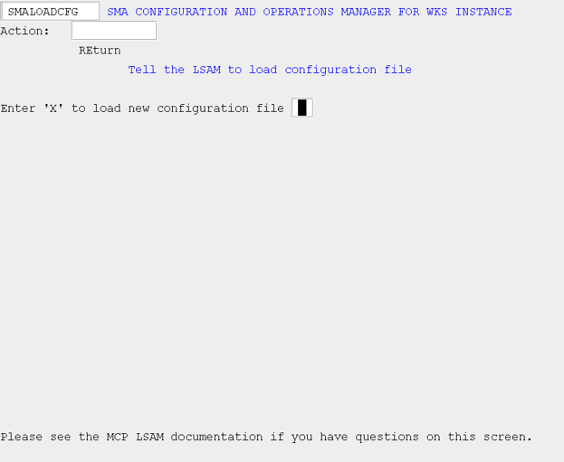
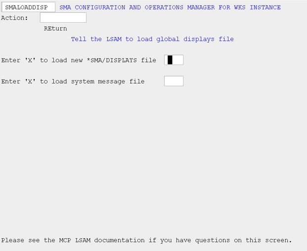
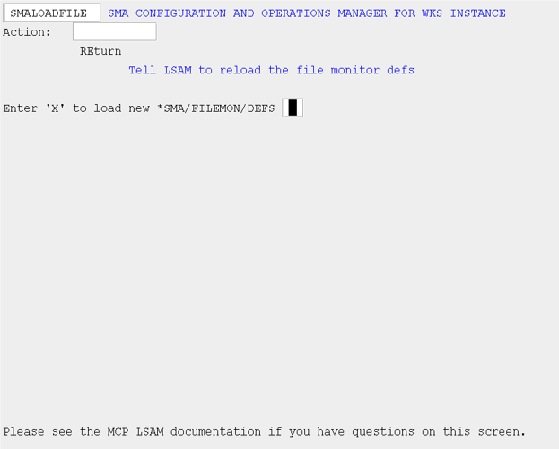
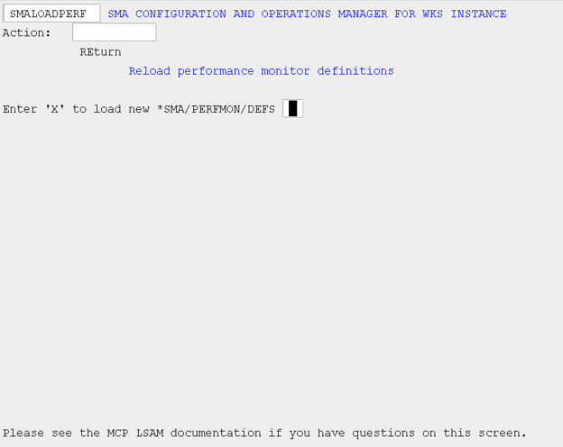

# Reload

## Reload LSAM Configuration (LOADCFG)

Use this screen to cause the LSAM to reload all configuration values except for "Max number concurrent jobs." If an optional module was previously not enabled, and is enabled in the latest LSAM configuration file, it will be initiated when the LSAM reloads the configuration file; however, if an optional module was previously enabled and is active, it will not be shut down when the new configuration file is loaded. The next time the LSAM is started, this now-disabled module will not be initiated.

The LSAM configuration variable, "Max number concurrent jobs," is not dynamic. In order to change the maximum number of concurrent jobs monitored by the LSAM, it is necessary to stop the LSAM, remove the tracking and checkpoint files, and then restart the LSAM.

###### SMA Configuration and Operations Manager: SMALOADCFG

## Reload Display Monitor Config (LOADDISP)

Use this screen to notify the Display Handler that the message definitions file has changed.

###### SMA Configuration and Operations Manager: SMALOADDISP

## Reload File Config (LOADFILE)

Use this screen to notify the Resource Monitor and File Monitor to reload the file monitor definitions.

###### SMA Configuration and Operations Manager: SMALOADFILE

## Reload Performance Config (LOADPERF)

Use this screen to notify the Resource Monitor to reload the resource monitor definitions.

###### SMA Configuration and Operations Manager: SMALOADPERF

