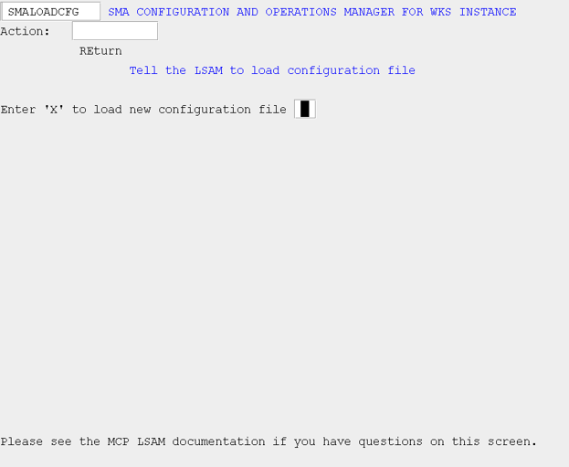
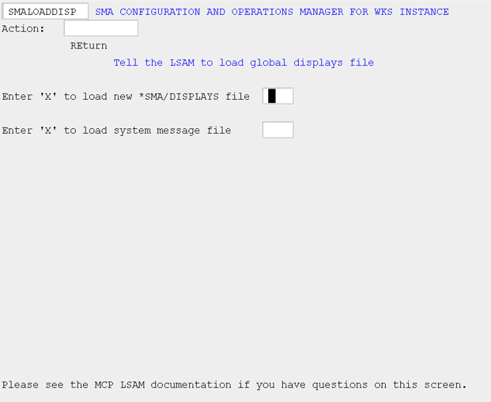
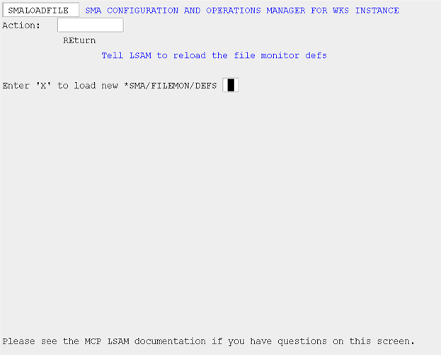
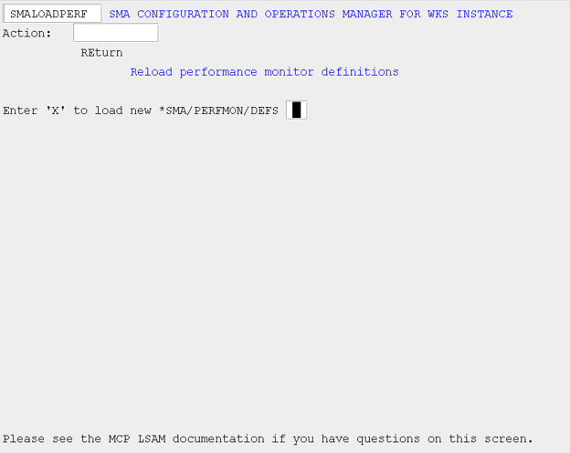

# Reload

## What is it?

The Reload screens send live instructions to the MCP Agent and its monitors to pick up updated configuration or definitions files without stopping and restarting the Agent. Four separate screens cover the Agent configuration (LOADCFG), display message definitions (LOADDISP), file monitor definitions (LOADFILE), and resource monitor definitions (LOADPERF).

- Use LOADCFG after saving changes on configuration screens to apply all settings except the maximum concurrent jobs value, which requires a full restart.
- Use LOADDISP, LOADFILE, or LOADPERF after editing the respective definitions files to activate the new monitoring rules immediately.

## Reload Agent Configuration (LOADCFG)

Use this screen to instruct the agent to reload all configuration values except for "Max number concurrent jobs." If an optional module was previously not enabled and is enabled in the latest agent configuration file, it will be initiated when the agent reloads the configuration file; however, if an optional module was previously enabled and is active, it will not be shut down when the new configuration file is loaded. The next time the agent starts, this now-disabled module will not be initiated.

The agent configuration variable "Max number concurrent jobs" is not dynamic. To change the maximum number of concurrent jobs monitored by the agent, stop the agent, remove the tracking and checkpoint files, and then restart the agent.

*SMA Configuration and Operations Manager: SMALOADCFG*

## Reload Display Monitor Config (LOADDISP)

Use this screen to notify the Display Handler that the message definitions file has changed.

*SMA Configuration and Operations Manager: SMALOADDISP*

## Reload File Config (LOADFILE)

Use this screen to notify the Resource Monitor and File Monitor to reload the file monitor definitions.

*SMA Configuration and Operations Manager: SMALOADFILE*

## Reload Performance Config (LOADPERF)

Use this screen to notify the Resource Monitor to reload the resource monitor definitions.

*SMA Configuration and Operations Manager: SMALOADPERF*

