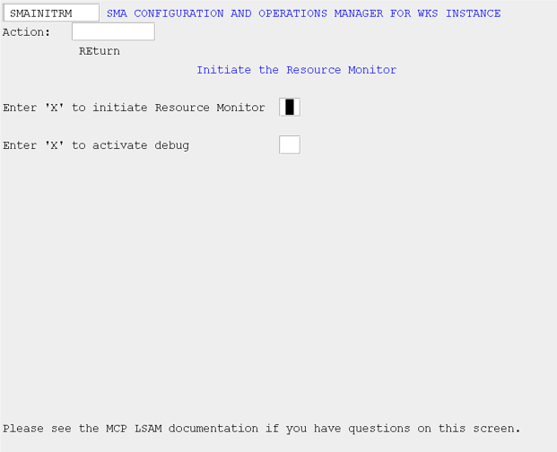
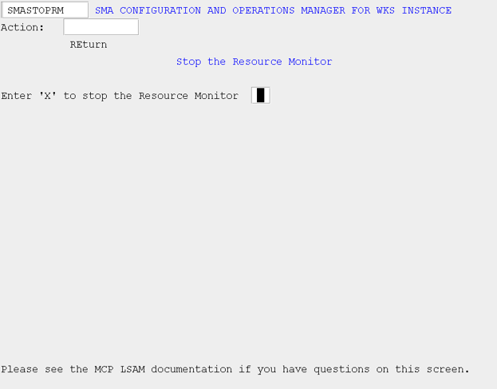

# Resource Monitor

## What is it?

The INITRM and STOPRM screens control the MCP Resource Monitor when it is configured to run outside the MCP Agent WFL, allowing it to be started and stopped independently. Even when the Resource Monitor was started alongside the Agent, it must always be stopped independently using STOPRM.

- Start the Resource Monitor on its own when you need system and file monitoring to run without also starting the MCP Agent.
- Stop the Resource Monitor independently to allow system monitoring to continue while the MCP Agent is offline.

## Initiate the Resource Monitor (INITRM)

Use this screen to start the MCP Resource Monitor only if you have not configured the agent to include the Resource Monitor within the agent WFL.

*SMA Configuration and Operations Manager: SMAINITRM*

## Stop the Resource Monitor (STOPRM)

Use this screen to stop the MCP Resource Monitor. If you have configured the agent to include the Resource Monitor within the agent WFL, you will still need to stop the Resource Monitor independently.

*SMA Configuration and Operations Manager: SMASTOPRM*

