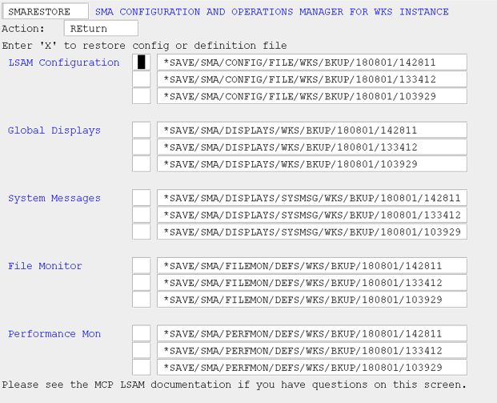

# Restore Configuration and Definitions Files (RESTORE)

## What is it?

The RESTORE screen presents up to three recent backups of each configuration and definitions file type, created automatically each time SMA Manager starts, so you can select and restore any of them without manually copying files. After restoring, you must use the appropriate Reload screen (LOADCFG, LOADDISP, LOADFILE, or LOADPERF) to notify the running Agent that the file has changed.

- Restore the agent configuration file, global displays file, system message file, file monitor definitions, or performance monitor definitions individually or in combination in a single operation.
- The Manager retains no more than 20 backups per file type and presents the three most recent, making it easy to identify which backup to use by its embedded date and time stamp.

Each time the SMA/MANAGER program is initiated, it automatically backs up all configuration files used by the agent: the agent configuration file, global displays definitions file, system message definitions file, file monitor definitions file, and performance monitor definitions file. Files are named by appending the date and time of the backup to the file name, making it easy to identify when the file was backed up.

To restore a production configuration file from a recent backup, select the RESTORE option from the Manager Main Menu. Before presenting the SMARESTORE screen, the Manager program removes backup files in excess of 20 per type of file. Up to three files of each type are presented on the SMARESTORE screen. You may select only one file of each type; however, you may restore multiple types of files at one time. After you restore the file, notify the agent that the file has been restored using the LOADCFG, LOADDISP, LOADFILE, and LOADPERF Main Menu choices as appropriate.

### SMA Configuration and Operations Manager: SMARESTORE

