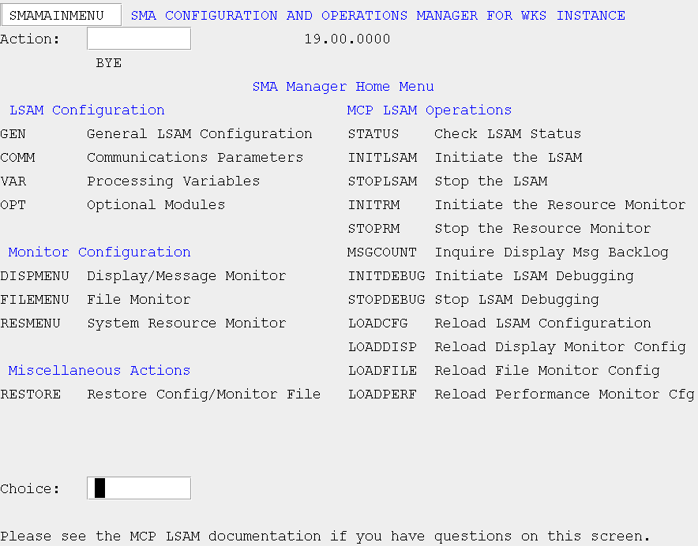

# SMA/MANAGER overview

## What is it?

The SMA/MANAGER program provides a single interface for performing configuration and operations tasks related to the MCP Agent. It replaces the \*SMA/CONFIG program and reduces the MCP-specific knowledge required to perform routine operational tasks.

- Use SMA/MANAGER to configure agent communication settings, optional modules, and processing variables without direct file editing.
- Use SMA/MANAGER to initiate, stop, and monitor the agent and Resource Monitor from a central menu-driven interface.
- Use SMA/MANAGER to maintain definition files for file monitoring, resource monitoring, and display definitions.

## Overview

Upon accessing \*SMA/MANAGER, you are presented with a main menu. All activities are performed by navigating successive screen Choices until the final screen is reached. In most cases, you need only make a selection from the Main Menu to arrive at the final screen.

## Using SMA/MANAGER

To access the Manager program, from any MCP window type ?ON SMAMGRxxx where xxx represents the unique agent instance identifier, if used. If you are not presented the Main Menu, transmit a space and the Main Menu will appear.

There are three fields on the Main Menu: screen name, Action, and Choice. The screen name is a protected field and cannot be changed, but is presented so that the SMA/MANAGER program can identify the function to be performed and to facilitate a point of reference when accessing documentation. Each screen has the possibility of displaying informational and error messages. For a list of these messages and their meaning, refer to [Error and Informational Messages](../../operations-and-components/sma-manager/error-and-informational-messages). These messages appear on the last line of the screen. If the message refers to an error in a field, the cursor will be placed in the field in error, a bell will sound, and the message will be in red or reverse video, depending on the terminal emulator in use.

For agent configuration fields, the allowed values are indicated on the screen adjacent to the field name. If no value is indicated, the field is not edited. In the upper left corner of each screen you will see the name of the screen. The name of this agent instance is notated in the heading. If this instance is not named, the word BASE will appear. The last line of the screen is reserved for error or informational messages. For more information, refer to [Error and Informational Messages](../../operations-and-components/sma-manager/error-and-informational-messages).

Agent configuration changes (Main Menu options COMM, GEN, OPT, and VAR) take effect only after 1) notifying the agent by submitting the LOADCFG choice via the Manager program, or 2) starting the agent if the agent was not running when the configuration changes were made. Saved changes to the File, Message, and System Resource definitions files take effect only after the appropriate agent components have been notified of the changes. Refer to the appropriate section for each definition file.

## Main Menu

It is from the Main Menu that the user exits the SMA/MANAGER program. To exit, type BYE in the Action field. To select an activity to perform, enter the mnemonic for the function in the Choice field.

