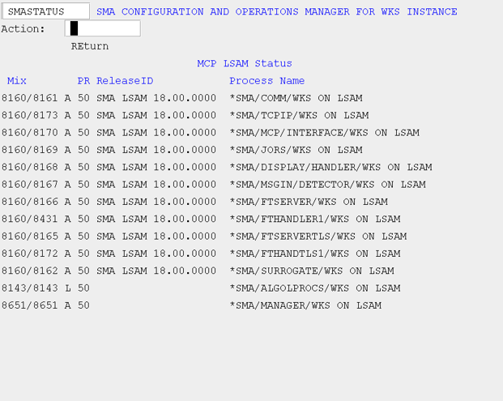

# Status (STATUS)

The STATUS screen shows the current status of all LSAM modules relative to this instance. There are five columns of information:

* Mix: Defines the job and task mix number of the process.
* Process type/status: Defines the process status. The possible values for this field are A(ctive), L(ibrary), S(cheduled), and W(aiting).
* PR (Priority): Defines the priority.
* ReleaseID: Defines the release ID.
* Process Name: Defines the process name.

###### SMA Configuration and Operations Manager: SMASTATUS

