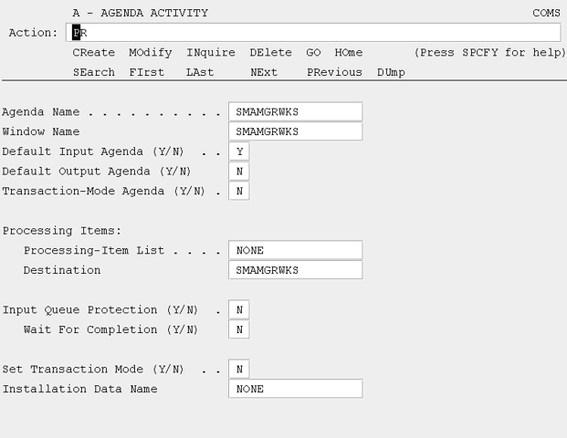
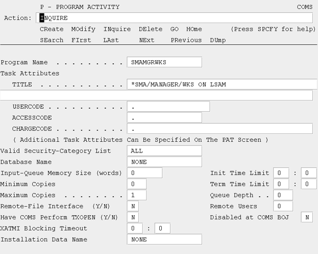
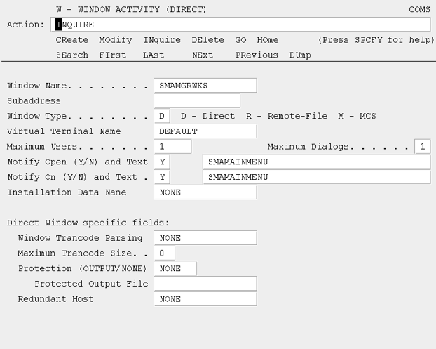

# Transaction Server (COMS) Utility Entities

Illustrated below are the entries which are made as part of the LSAM installation process. These entities must not be modified or deleted by the user unless specifically instructed to do so by SMA Technologies.

### Transaction Server (COMS) Utility Entities: Agenda Activity

### Transaction Server (COMS) Utility Entitites: Program Activity

### Transaction Server (COMS) Utility Entities: Window Activity

