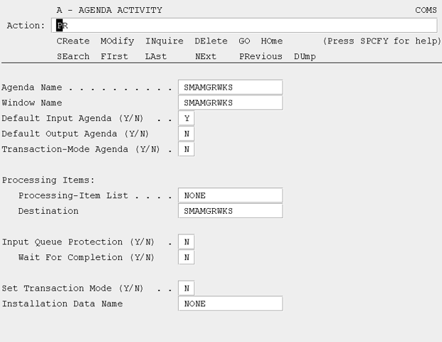
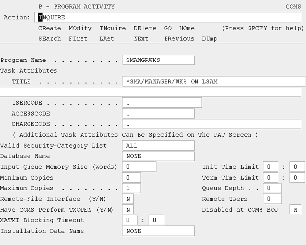
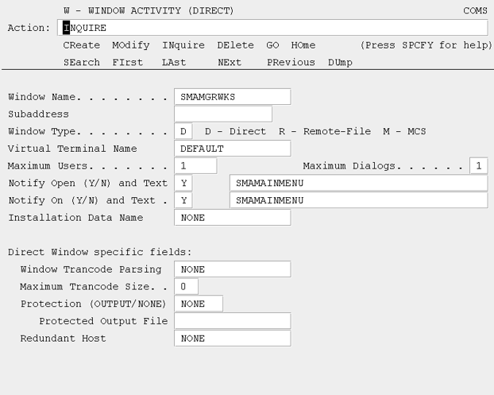

# Transaction Server (COMS) Utility Entities

## What is it?

The Transaction Server (COMS) Utility Entities page documents the Agenda Activity, Program Activity, and Window Activity entries that are configured in the MCP Transaction Server as part of the MCP Agent installation. These entries are required for the Agent to operate and must not be changed or removed unless SMA Technologies Support specifically instructs you to do so.

- Review the Agenda Activity, Program Activity, and Window Activity screenshots to verify that installation created the expected COMS entries.
- Use these reference images when troubleshooting COMS-related communication issues with SMA Technologies Support.

The following screenshots show the entries created as part of the agent installation process. Do not modify or delete these entities unless specifically instructed to do so by SMA Technologies.

### Transaction Server (COMS) Utility Entities: Agenda Activity

### Transaction Server (COMS) Utility Entitites: Program Activity

### Transaction Server (COMS) Utility Entities: Window Activity

