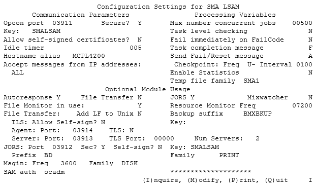

# Legacy Information

This section contains information that has been preserved from prior to the MCP LSAM 18.00.00 release. Effective with the 18.00.00 release, a new user interface tool called SMA/MANAGER was introduced. This tool replaces the SMA/CONFIG program and provides the user with an Operations interface for accomplishing many tasks that previously required the user to interact directly with the MCP operating system. As a result, the instructions in this section have been replaced by the instructions within the main body of the MCP LSAM Administration guide. Please refer to the [MCP LSAM Configuration](../configuration/mcp-lsam-configuration) and [MCP LSAM Operations and Components](../operations-and-components/mcp-lsam-operation) sections for current instructions on using SMA/MANAGER.

## Automated Installation/Upgrade

### Stop the LSAM and Resource Monitor

:::info Note 

Please allow up to five minutes for the components to shut themselves down.

:::

1. Set the task value of \*SMA/COMM/xxx to 2.

2. On the MARC main menu screen, go to the Action line. Type ```<mix number of *SMA/COMM>``` HI 2. Transmit the line.

3. Repeat Steps 1 and 2 for *SMA/RESOURCE/MONITOR, if active.

To view the new procedure, refer to [Stop the LSAM and Resource Monitor](../installation/upgrade-installation#stop-the-lsam-and-resource-monitor) in the Automated Installation/Upgrade topic.
 
## Run the Configuration Program

### Run the Configuration Program

1. On the MARC main menu screen, go to the Choice line. Type RUN. Transmit the line.

2. On the RUN screen, go to the Task name field. Type *SMA/CONFIG/xxx ON ```<PACK NAME>```.

3. On the Action line, Transmit.

4. ```<TAB>``` to move between fields on the configuration screen.

5. Modify fields in the configuration file, as needed.

:::info Note 

Changing the "Max number concurrent jobs" setting requires additional procedures. For information on updating the "Max number concurrent jobs" setting, refer to [Update the "Max Number Concurrent Jobs" Field](../configuration/update-max-concurrent-jobs).

:::

6. When necessary, go to the IMPQ field.

a. To Inquire about current settings, type I.

b. To save Modifications, type M.

c. To Print the settings, type P.

d. To Quit, type Q.

7. Transmit the screen.

To view the new procedure, refer to the [Run the Manager Program](../configuration/configuration-settings#run-the-manager-program) topic.

### Configuration Settings

Configuration Settings for SMA LSAM
 


The next several topics describe the fields found on the SMA/CONFIG screen.
 
To view the new settings, refer to [Configuration Settings](../configuration/configuration-settings) in the Run the Manager Program topic.

The next several topics describe the fields found on the SMA/CONFIG screen.
 
To view the new settings, refer to Configuration Settings in the Run the Manager Program topic.
 
White "person reading" icon on blue circular background Related Topics
Communication Parameters (Legacy)
Processing Variables (Legacy)
Optional Modules (Legacy)
 
## MCP LSAM Operation

### Create a Usercode and Assign Privileges

1. On the MARC main menu screen, go to the Choice line. Type USERS. Transmit the line.

2. On the Usercodes and Passwords screen, go to the Choice line. Type USERS. Transmit the line.

3. On the Makeuser screen:

a. In the Enter Usercode field, type OPCONXPS.

b. In the ADD field, type X.

c. Go to the Home position. Transmit the screen.

4. On the Makeuser - Basic Usercode Attributes screen:

a. Enter the usercode's password and FAMILY assignments required by the LSAM machine.

b. Select user attributes by typing an X beside the following fields:
* Privileged User
* System User
* SHOWFILES

c. Go to the Home position. Transmit the screen.

5. On the Action line, type QUIT. Transmit the line.

### Start the LSAM

1. Log in to the ClearPath MCP using the usercode created in the Create a Usercode and Assign Privileges procedure.

Start the LSAM using any of the three following methods:

a. Create a WFL containing the following information:

```
?BEGIN JOB START/LSAM;
CLASS = < Queue with sufficient MIXLIMIT and TASKLIMIT attributes to accommodate the number of jobs anticipated to be run over the course of the LSAM cycle life.>;
TASK T;
JOBSUMMARYTITLE = ```<optional unique job summary title attribute>```;
JOBSUMMARY = UNCONDITIONAL;
BDNAME = ```<optional BDNAME task attribute>```;
T (PRINTDEFAULTS = (SAVEPRINTFILE = TRUE));
RUN *SMA/COMM/xxx ON ```<PACK NAME>``` [T];
?END JOB;

```

\- or -

Manually ```RUN *SMA/COMM/xxx ON<PACK NAME>; BDNAME=<optional BDNAME task attribute>``` 

\- or -

Auto Initiate the LSAM. To define this from the MCP ODT, enter:

```AI + SMALSAM<optional LSAM identifier> = *SMA/COMM/xxx ON <diskpack>3,```


:::info Note 

Options (a) or (c) are preferred over method (b) because they will cause the LSAM to be automatically restarted following a halt load, enabling automatic restart and recovery of the LSAM.
 
To use a print prefix other than *BD, specify the BDNAME ```<value>``` task attribute in the WFL that initiates the LSAM. This approach is recommended for those sites at which print files reside only for a short time on the MCP platform (i.e., when an extract program removes the print files periodically or when a site's policy directs print files not to be retained). Additional task attributes, such as PRINTDEFAULTS, JOBSUMMARYTITLE, and JOBSUMMARY, may be appropriate for the site. In particular, the (PRINTDEFAULTS = (SAVEPRINTFILE = TRUE)) statement should be considered.

:::

To view the new procedure, refer to [Start the LSAM](http://localhost:3000/opcon/agents/mcp/operations-and-components/mcp-lsam-operation#start-the-lsam) in the LSAM Operation topic.

### Stop the LSAM

Stop the LSAM using either of the two methods provided in this section. For either option, allow up to five minutes for the components to shut themselves down.
 
#### Option One: Stop the Components

1. Set the task value of *SMA/TCPIP/xxx to 2.

2. On the MARC main menu screen, go to the Action line. Type ```<mix number of *SMA/TCPIP/xxx>``` HI 2. Transmit the line.

#### Option Two: Stop the Main Process

1. Set the task value of *SMA/COMM/xxx to 99.

2. On the MARC main menu screen, go to the Action line. Type ```<mix number of *SMA/COMM/xxx>``` HI 99. Transmit.

To view the new procedure, refer to [Stop the LSAM](../operations-and-components/mcp-lsam-operation#stop-the-lsam) in the LSAM Operation topic.
 
## MCP LSAM Components

### *SMA/CONFIG

The LSAM configuration program, used to maintain the LSAM's configuration file.

#### *SMA/CONFIG Associated Files

| External File Title | Permanent? | Description |
| ------------------- | ---------- | ----------- |
| *SMA/CONFIG/AUDIT/xxx | Y | This file contains an audit history of changes to the LSAM configuration file. |
| CONFIG_SCREEN | N | This remote file is used to interact with users. |
| CONFIG_PROGRAM | N | This file is used to determine environment variables. |
| *BD/…../LINE | Y | - This print file contains a report of the LSAM configuration settings. <br></br> - The name of this file may differ depending on the site print defaults and/or the use of the BDNAME task attribute. |
 
## Automated Response Data File

### Create the Necessary Displays File(s)

Global: If you suspect that you are experiencing a delay due to high display message volume, you may determine the number of display messages waiting to be processed by issuing an AX COUNT command to the *SMA/DISPLAY/HANDLER. The display message backlog will be displayed on the system console.
 
To view the new information, refer to [Global](../additional-features/lsam-features/automated-response#automated-response-data-file) in the Automated Response Data File topic.

### Define an Automated Response

1. Do not modify the production copy of the Definitions File directly. SMA Technologies strongly recommends that a working copy of the production displays Definitions File be used to make changes. Modifying the production copy of the file may cause unexpected results.

2. Edit a copy of the file using CANDE or another editor.

3. Run the \*SMA/SYNTAX/CHECK program to validate the syntax of the definitions.

4. If the Definitions File passes the syntax validation, copy the Definitions File to the MCP test area.

5. If testing is successful, copy the Definitions File to the MCP production environment.

To view the new procedure, refer to [Define an Automated Response](../additional-features/lsam-features/automated-response#define-an-automated-response) in the Automated Response Data File topic.
 
## Dynamic LSAM Configuration

For all LSAM configuration variables, except 'Max number concurrent jobs', changes made to the LSAM configuration file may be applied while the LSAM is active. To apply the changes, you must deliver an AX CONFIG to the \*SMA/COMM/xxx and \*SMA/RESOURCE/MONITOR/xxx programs. If any of the Optional Modules were not started when the LSAM was initiated, or have been stopped, and they have since been activated in the LSAM's configuration file, deliver an AX CONFIG to the \*SMA/COMM module to initiate them. However, if you initiated one of those Optional Modules with the LSAM and have since deactivated it within the LSAM configuration file, the current execution of that module will not be stopped. It simply will not be initiated by the LSAM the next time the LSAM is started.
 
If the AX CONFIG request is misspelled (e.g., AX CONVAL) the erroneous input will be displayed, followed by "request REJECTED!"
 
To view the new information, refer to the [Dynamic LSAM Configuration](../additional-features/lsam-features/dynamic-lsam-configuration) topic.
 
## File Monitor Data File

### File Rules

:::info Note 

Do not modify the production copy of any definitions file directly. SMA Technologies strongly recommends that a working copy of the production definitions file be used to make changes. Modifying the production copy of the file may cause unexpected results.

:::

1. All definitions must start in the first position of the record.

2. Edit a copy of the file using CANDE or another editor.

3. Run the \*SMA/SYNTAX/CHECK program to validate the syntax of the definitions.

4. If the definitions file passes the syntax validation, copy the definitions file to the MCP test area.

5. If testing is successful, copy the definitions file to the MCP production environment.

6. The File Monitor Data File is dynamic. After updating and validating the \*SMA/FILEMON/DEFS/xxx file, deliver an AX FILEMON to the \*SMA/RESOURCE/MONITOR/xxx program. This causes both programs reload the \*SMA/FILEMON/DEFS/xxx file. The \*SMA/SYNTAX/CHECK/xxx program will report any errors detected. These errors must be corrected before further file monitoring can take place.

To view the new procedure, refer to [File Rules](../additional-features/lsam-features/file-monitor#files-rules) in the File Monitor Data File topic.
 
## Start the Resource Monitor

You may opt to use a WFL or the AI command to initiate the Resource Monitor. This simple WFL starts the Resource Monitor:

```

?BEGIN JOB SMA/RESOURCE/MONITOR;
RUN *SMA/RESOURCE/MONITOR/xxx ON ```<diskpack>```;
?END JOB.
 
```

To view the new information, refer to the [Start the Resource Monitor](../additional-features/lsam-features/resource-monitor#start-the-resource-monitor) topic.
 
## Maintenance of Definitions Files

1. Do not modify the production copy of any definitions file directly. SMA Technologies strongly recommends that a working copy of the production definitions file be used to make changes. Modifying the production copy of the file may cause unexpected results.

2. Edit a copy of the file using CANDE or another editor.

3. Run the \*SMA/SYNTAX/CHECK program to validate the syntax of the definitions.

4. If the definitions file passes the syntax validation, copy the definitions file to the MCP test area.

5. If testing is successful, copy the definitions file to the MCP production environment.

6. If the file monitor definitions file, performance monitor definitions file, or system message definitions file was modified, notify the *SMA/RESOURCE/MONITOR to refresh its internal tables with the new definitions, ```<mix#>``` AX FILEMON, ```<mix#>``` AX PERFMON, and ```<mix#>``` AX SYSMSG, respectively.

To view the new procedure, refer to [Maintain Definitions Files](../additional-features/lsam-features/resource-monitor#maintenance-of-definitions-files) in the Maintenance of Definitions Files topic.
 
## File Monitoring

Each time a file close notification is received, it will be processed by the Resource Monitor and forwarded to the File Monitor. If you update the \*SMA/FILEMON/DEFS /xxx file and wish for the changes to take effect immediately as opposed to upon the next initiation of the Resource Monitor, you should deliver an AX FILEMON message to the \*SMA/RESOURCE/MONITOR/xxx program. This will cause the Resource Monitor to the list of files to be refreshed without the need to terminate the Resource Monitor. The Resource Monitor will inform \*SMA/FILE/MONITOR/xxx of the changes to \*SMA/FILEMON/DEFS/xxx so that the pointers to the associated actions within the file will be accurate.
 
To view the new information, refer to the [File Monitoring](../additional-features/lsam-features/file-monitor) topic.

### SMA/FILE/MONITOR Behavior

If the file monitor definitions file has been modified and you desire to implement the changes immediately as opposed to with the next initiation of the Resource Monitor and File Monitor, you should deliver an AX FILEMON to the Resource Monitor, \*SMA/RESOURCE/MONITOR/xxx. This will cause only the File Monitor to close and reopen the definitions file so the pointers received from the Resource Monitor will coincide with the record locations within the file.
 
To view the new information, refer to [SMA/FILE/MONITOR Behavior](../additional-features/lsam-features/file-monitor) in the File Monitoring topic.
 
## Problem Resolution and Debugging

### Enable Debug

Deliver to the \*SMA/COMM/xxx module an AX DEBUG ```<optional timer>``` command, where ```<optional timer>``` is the number of minutes for which to capture debug information. If the timer is omitted, debugging will remain active until a) an AX LOGS command is delivered to the \*SMA/COMM/xxx module, or b) the LSAM is brought down. This method sets debug switches for all the LSAM components, excluding the Resource and File Monitors. To enable debugging for the Resource and File Monitors, deliver an AX DEBUG ```<optional timer>``` to the \*SMA/RESOURCE/MONITOR/xxx module.
 
To view the new information, refer to [Enable Debug](../debugging) in the Problem Resolution and Debugging topic.